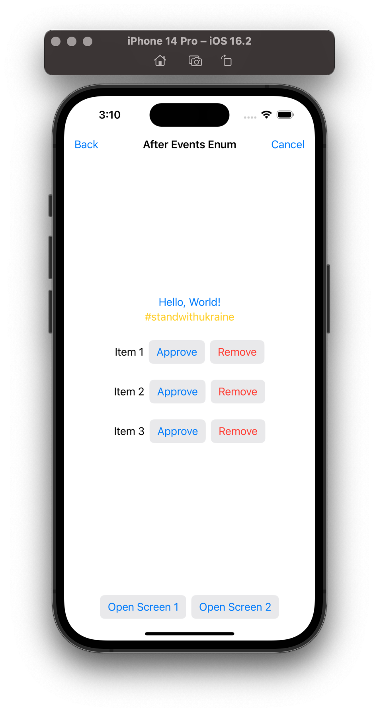
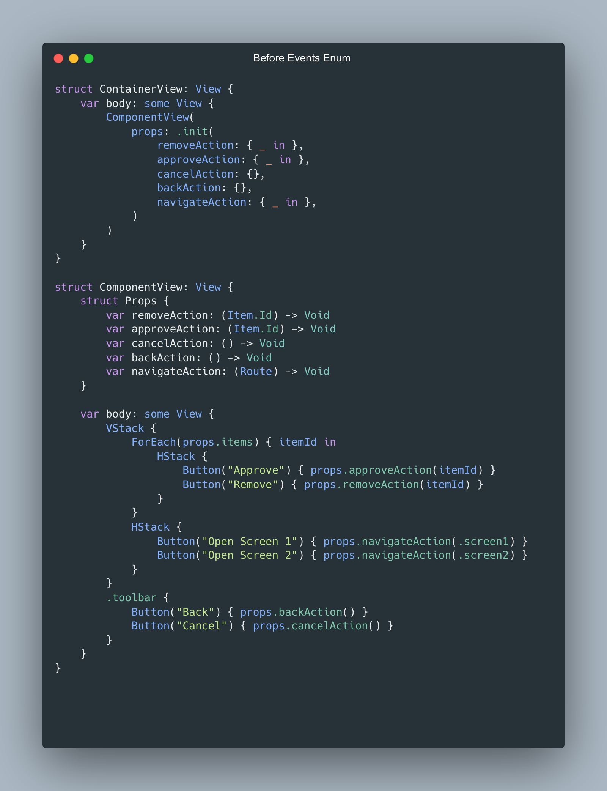
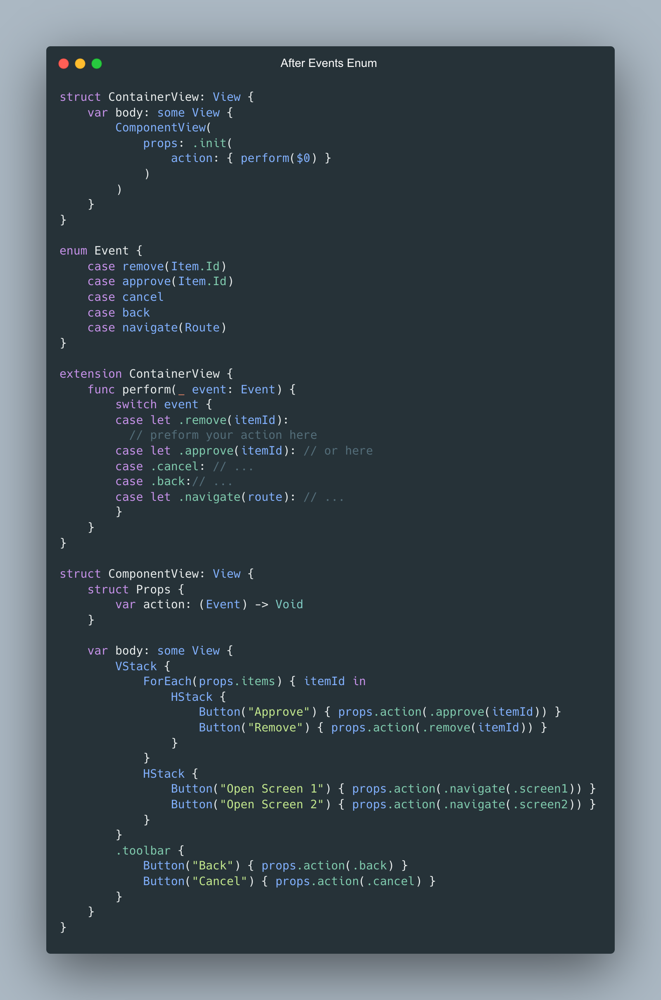

> Thanks author for the [article](https://azamsharp.com/2023/01/24/grouping-events-swiftui-view-using-enums.md.html)

> My related post in [LinkedIn](https://www.linkedin.com/posts/vladyslav-fil_iosdevelopment-swiftui-codingtips-activity-7030172083221319680-D6kS?utm_source=share&utm_medium=member_desktop)

###### If my work has brought you value or made your day a little brighter, show your appreciation



<a href="https://www.buymeacoffee.com/vfil" align="left">

<br/>

</a>

###### For running this sample on simulator replace `ContentView()` with one of these Views in `SamplesApp.swift` file.

```swift
@main
struct SamplesApp: App {
    var body: some Scene {
        WindowGroup {
//            ContentView()
            BeforeEventsEnumContainerView()
            // Or
//            AfterEventsEnumContainerView()
        }
    }
}
```



