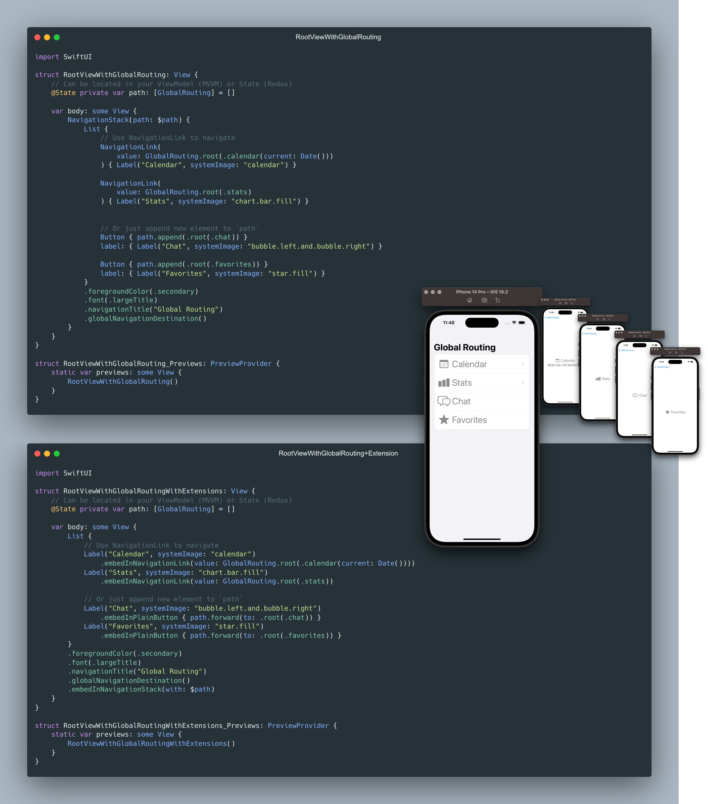
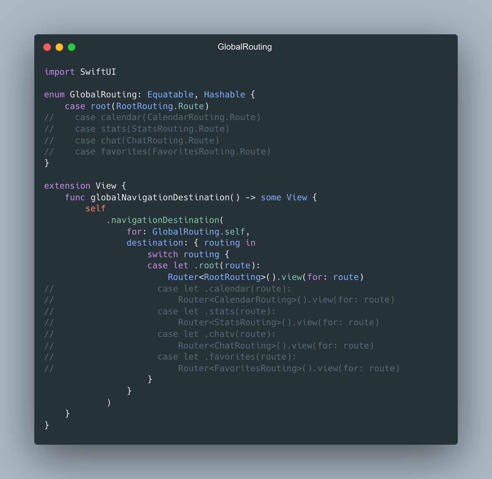
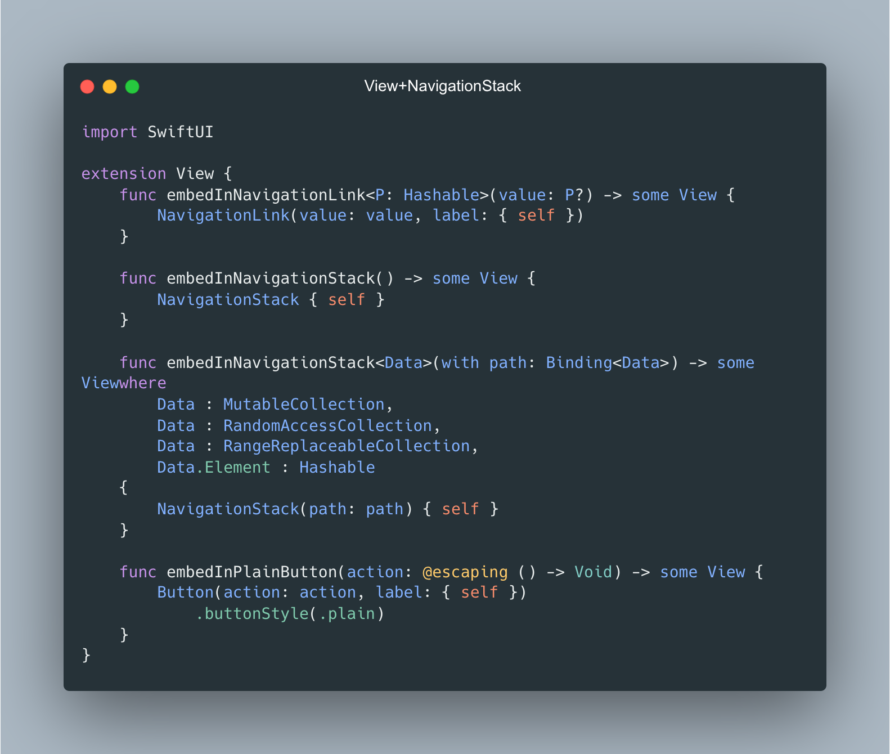
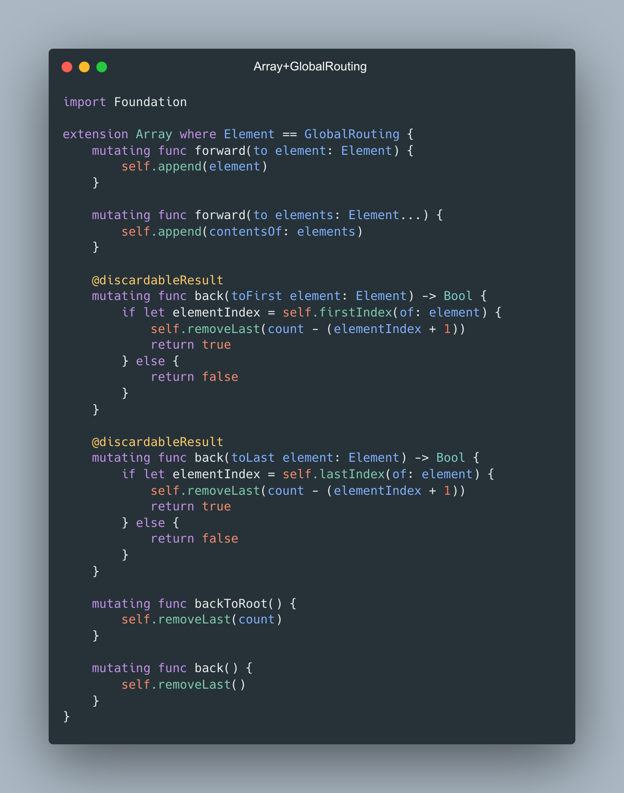
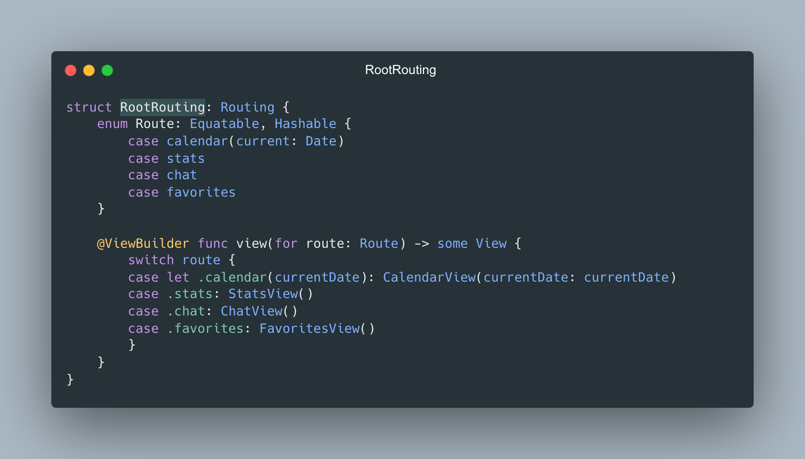

> My related post in [LinkedIn](https://www.linkedin.com/posts/vladyslav-fil_iosdevelopment-swiftui-codingtips-activity-7031876877497573376-5JRE?utm_source=share&utm_medium=member_desktop)

# Global Routing
implemented using [Routing protocol](https://github.com/Wsewlad/samples/tree/main/Samples/Routing%20and%20Router) and iOS16's [NavigationStack](https://developer.apple.com/documentation/swiftui/navigationstack)


```Swift
import SwiftUI

struct RootViewWithGlobalRoutingWithExtensions: View {
    // Can be located in your ViewModel (MVVM) or State (Redux)
    @State private var path: [GlobalRouting] = []
    
    var body: some View {
        List {
            // Use NavigationLink to navigate
            Label("Calendar", systemImage: "calendar")
                .embedInNavigationLink(value: GlobalRouting.root(.calendar(current: Date())))
            Label("Stats", systemImage: "chart.bar.fill")
                .embedInNavigationLink(value: GlobalRouting.root(.stats))
            
            // Or just append new element to `path`
            Label("Chat", systemImage: "bubble.left.and.bubble.right")
                .embedInPlainButton { path.forward(to: .root(.chat)) }
            Label("Favorites", systemImage: "star.fill")
                .embedInPlainButton { path.forward(to: .root(.favorites)) }
        }
        .foregroundColor(.secondary)
        .font(.largeTitle)
        .navigationTitle("Global Routing")
        .globalNavigationDestination()
        .embedInNavigationStack(with: $path)
    }
}

struct RootViewWithGlobalRoutingWithExtensions_Previews: PreviewProvider {
    static var previews: some View {
        RootViewWithGlobalRoutingWithExtensions()
    }
}
```
## GlobalRouting

```Swift
import SwiftUI

enum GlobalRouting: Equatable, Hashable {
    case root(RootRouting.Route)
}

extension View {
    func globalNavigationDestination() -> some View {
        self
            .navigationDestination(
                for: GlobalRouting.self,
                destination: { routing in
                    switch routing {
                    case let .root(route):
                        Router<RootRouting>().view(for: route)
                    }
                }
            )
    }
}
```

## View+NavigationStack


```Swift
import SwiftUI

extension View {
    func embedInNavigationLink<P: Hashable>(value: P?) -> some View {
        NavigationLink(value: value, label: { self })
    }
    
    func embedInNavigationStack() -> some View {
        NavigationStack { self }
    }
    
    func embedInNavigationStack<Data>(with path: Binding<Data>) -> some View
    where
        Data : MutableCollection,
        Data : RandomAccessCollection,
        Data : RangeReplaceableCollection,
        Data.Element : Hashable
    {
        NavigationStack(path: path) { self }
    }
    
    func embedInPlainButton(action: @escaping () -> Void) -> some View {
        Button(action: action, label: { self })
            .buttonStyle(.plain)
    }
}
```

## Array+GlobalRouting


```Swift
import Foundation

extension Array where Element == GlobalRouting {
    mutating func forward(to element: Element) {
        self.append(element)
    }
    
    mutating func forward(to elements: Element...) {
        self.append(contentsOf: elements)
    }
    
    @discardableResult
    mutating func back(toFirst element: Element) -> Bool {
        if let elementIndex = self.firstIndex(of: element) {
            self.removeLast(count - (elementIndex + 1))
            return true
        } else {
            return false
        }
    }
    
    @discardableResult
    mutating func back(toLast element: Element) -> Bool {
        if let elementIndex = self.lastIndex(of: element) {
            self.removeLast(count - (elementIndex + 1))
            return true
        } else {
            return false
        }
    }
    
    mutating func backToRoot() {
        self.removeLast(count)
    }
    
    mutating func back() {
        self.removeLast()
    }
}
```

## RootRouting


```Swift
struct RootRouting: Routing {
    enum Route: Equatable, Hashable {
        case calendar(current: Date)
        case stats
        case chat
        case favorites
    }
    
    @ViewBuilder func view(for route: Route) -> some View {
        switch route {
        case let .calendar(currentDate): CalendarView(currentDate: currentDate)
        case .stats: StatsView()
        case .chat: ChatView()
        case .favorites: FavoritesView()
        }
    }
}
```

###### If my work has brought you value or made your day a little brighter, show your appreciation

<a href="https://www.buymeacoffee.com/vfil">

<br/>

</a>
