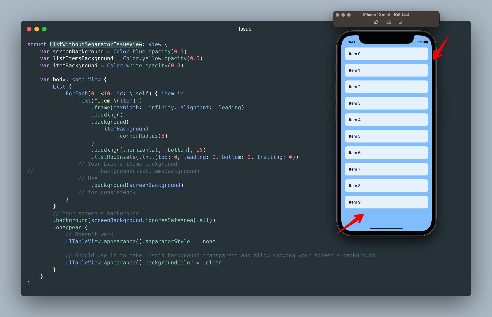
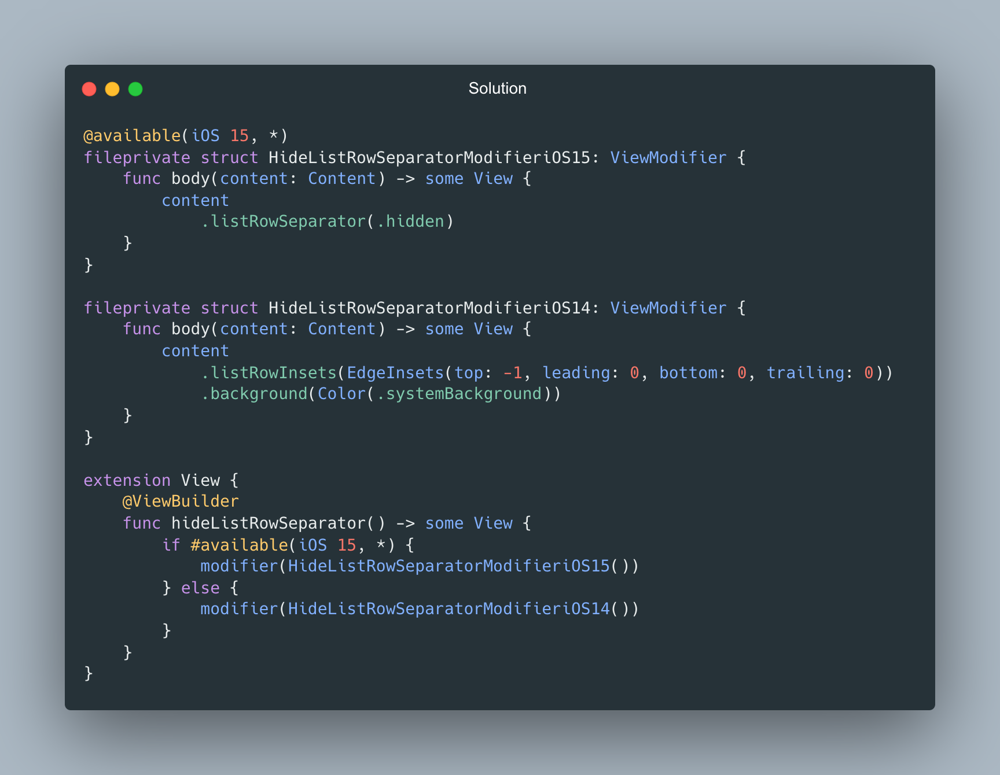
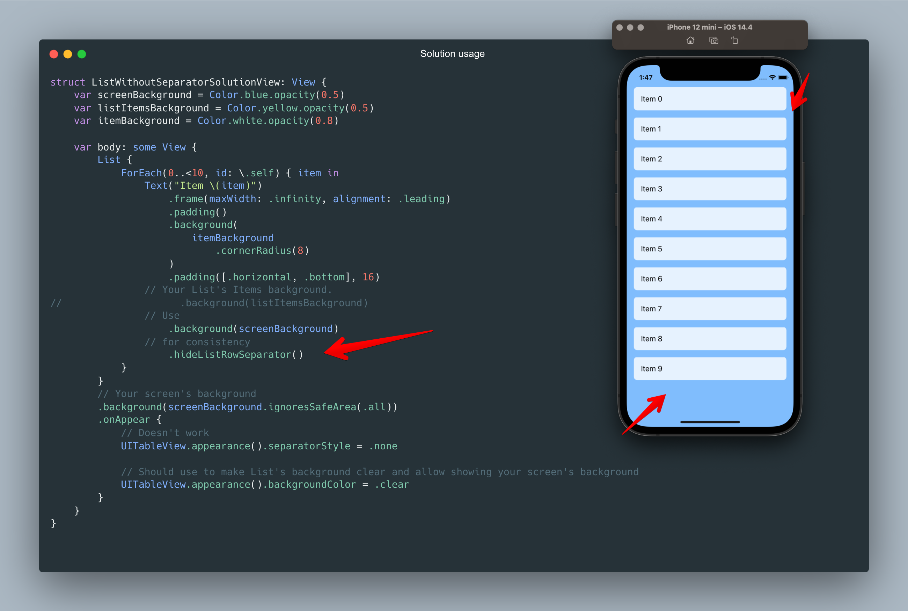

> My related post in [LinkedIn](https://www.linkedin.com/posts/vladyslav-fil_iosdevelopment-swiftui-codingtips-activity-7030522350907346944-6N3k?utm_source=share&utm_medium=member_desktop)

###### If you like what I do and want to support me, please

<a href="https://www.buymeacoffee.com/vfil">

 

</a>

