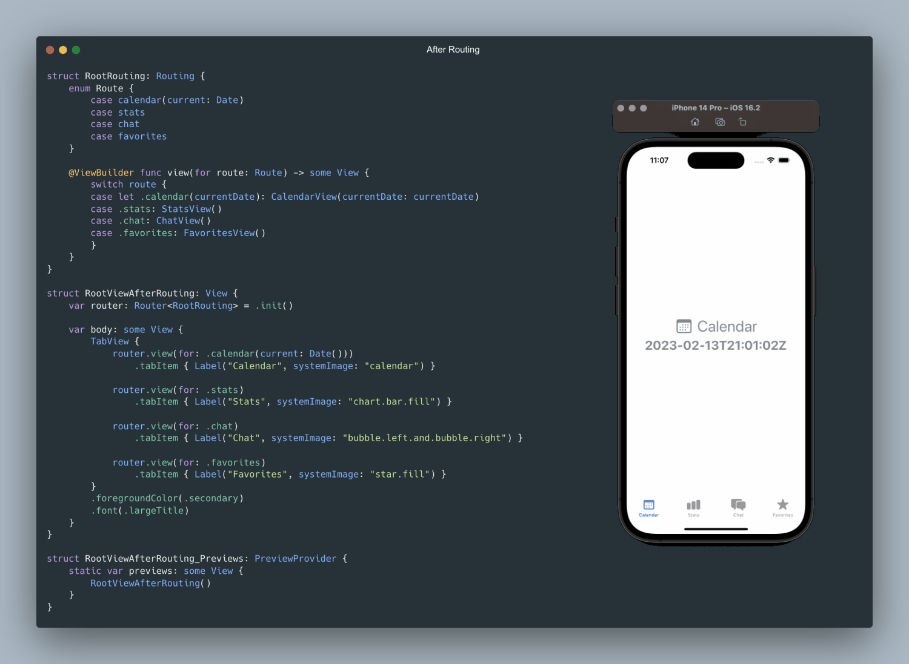

> My related post in [LinkedIn](https://www.linkedin.com/posts/vladyslav-fil_iosdevelopment-swiftui-codingtips-activity-7031169346613719040-zURa)

# Routing


```Swift
import SwiftUI

//MARK: - Initable
protocol Initable {
    init()
}

//MARK: - Routing
protocol Routing<Route>: Initable {
    associatedtype Route
    associatedtype Destination : View

    func view(for route: Route) -> Destination
}

//MARK: - Router
final class Router<R> where R : Routing {
    final var routing: R

    init(routing: R) {
        self.routing = routing
    }
    
    init() {
        self.routing = .init()
    }

    final func view(for route: R.Route) -> some View {
        routing.view(for: route)
    }
}
```



```Swift
var router: Router<RootRouting> = .init()

struct RootRouting: Routing {
    enum Route: Equatable, Hashable {
        case calendar(current: Date)
        case stats
        case chat
        case favorites
    }
    
    @ViewBuilder func view(for route: Route) -> some View {
        switch route {
        case let .calendar(currentDate): CalendarView(currentDate: currentDate)
        case .stats: StatsView()
        case .chat: ChatView()
        case .favorites: FavoritesView()
        }
    }
}
```

###### If my work has brought you value or made your day a little brighter, show your appreciation

<a href="https://www.buymeacoffee.com/vfil">

<br/>

</a>
